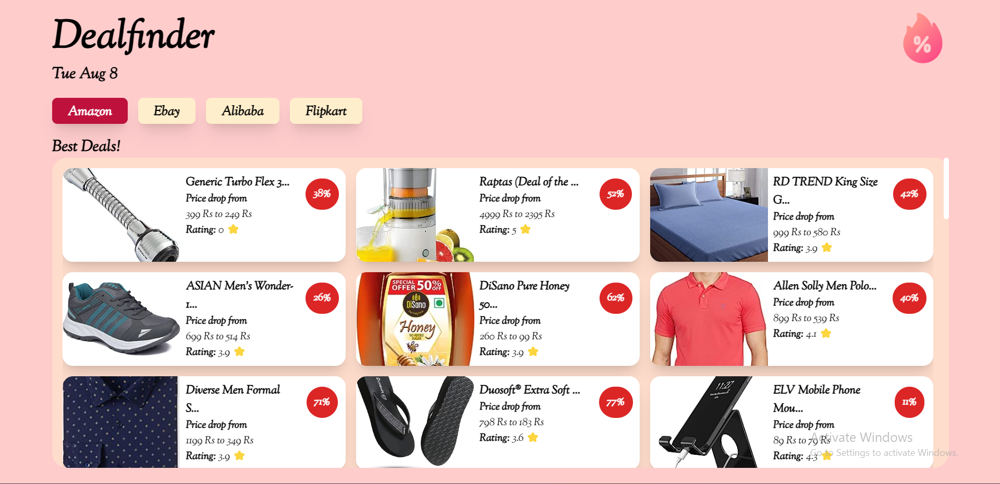

# DealFinder

DealFinder is a web application built using React, Express, and Tailwind CSS. The project revolves around fetching the best deals of the day from Amazon using the Oxylabs API. Oxylabs is a renowned company specializing in web data gathering and providing proxy solutions for various market research activities.

## TechStack

## Features

-   Utilizes React for the frontend, creating an intuitive and responsive user interface.
-   Implements Express on the backend to handle API requests and communication.
-   Employs Tailwind CSS for streamlined styling, ensuring a modern and visually appealing design.
-   Leverages Oxylabs' wescrapping API to scrape and aggregate the most enticing deals from Amazon.
-   Presents the gathered deals on the website's interface, allowing users to explore and benefit from the latest discounts.

## Screenshots
#### Desktop View Image

#### Mobile View Image

## How it Works

1.  The server, built with Express, interfaces with the Oxylabs API to retrieve Amazon's best daily deals.
2.  Oxylabs' web scraping API extracts deal information, including product details and discounts.
3.  The frontend, developed in React and styled with Tailwind CSS, showcases the deals in an organized and user-friendly manner.
4.  Users can conveniently browse the latest offers, making informed purchasing decisions.

## Installation and Usage

Follow these steps to set up and use DealFinder on your local machine:

1.  **Clone the Repository:** Clone the DealFinder repository to your local machine using the following command:
    
2.  **Install Dependencies:** Navigate to the `frontend` and `backend` folders using your terminal or command prompt.
    
    -   In the `frontend` folder, install the necessary packages by running:
        `cd frontend
        npm install` 
        
    -   In the `backend` folder, install the required packages using:
        `cd backend
        npm install` 
        
3.  **Start the Server and Frontend:**
    
    -   To start the backend server, run the following command in the `backend` folder:
        `nodemon server.js` 
        
    -   For the frontend, use the following command in the `frontend` folder:  
        `npm run dev` 
        
4.  **Access the Website:** Once both the backend and frontend servers are running, open your web browser and navigate to the provided URL (usually [http://localhost:3000](http://localhost:3000/)). You will be greeted with the DealFinder website where you can explore the best deals of the day.

Thanks for [Oxylabs](https://oxylabs.io/) for providing an amazing API.

Enjoy the convenience of browsing and discovering exciting deals with DealFinder!
